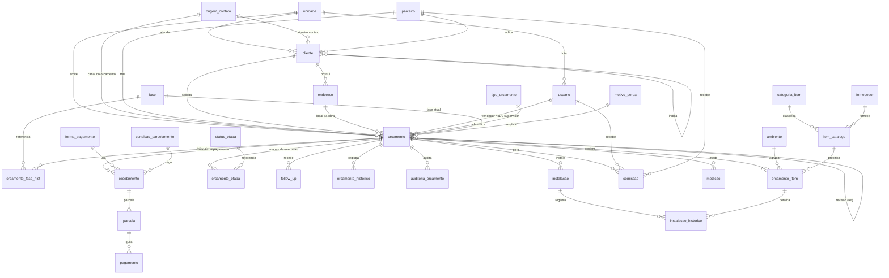

# Modelo de Dados do Staging: referência técnica

<!-- nav:start -->
[Home](../README.md) | [← Entendimento dos Dados](02_entendimento_dados.md) | [Régua de Validação →](04_regua_validacao.md)
<!-- nav:end -->

> Referência técnica do banco `db_fictoria` (SQL Server): o diagrama do modelo e o objetivo de cada uma das 30 tabelas, schema a schema. A fonte da verdade estrutural é o DDL T-SQL comentado em [`staging/ddl/`](../staging/ddl/); este documento é o mapa de leitura. Para o conceito de negócio por trás de cada domínio, leia antes o [Entendimento dos Dados](02_entendimento_dados.md).

## 1. Diagrama (relacionamentos-chave)

## 2. Convenções

- **Nomes** em `snake_case`, singular; chaves primárias `id` (`IDENTITY` nas tabelas transacionais, valores fixos nos catálogos); chaves estrangeiras `<entidade>_id`; constraints nomeadas (`pk_`, `fk_`, `uq_`, `ck_`, `df_`).
- **Domínios fechados** por `CHECK` (grupo da fase, tipo de parceiro, cargo, tipo de contato...).
- **Colunas de controle em toda tabela:** `dt_atualizacao datetime2(0)` (última gravação) e `rv rowversion` (contador do SQL Server, incrementado a cada gravação). São a marca d'água da carga incremental.
- **Cancelamento é lógico:** `dt_cancelou`/`dt_cancelamento` preenchidos; nada é apagado fisicamente.
- **Dinheiro** em `decimal(14,2)`, percentuais em `decimal(5,2)` (0 a 100), datas de evento em `datetime2(0)`, datas de calendário em `date`.
- **Collation** `Latin1_General_100_CI_AI_SC_UTF8`: acentos e caixa não distinguem, e `varchar` guarda UTF-8.

## 3. `cadastro` (16 tabelas)

| tabela | objetivo | chave / observações |
|---|---|---|
| `unidade` | showrooms da Fictoria, com data de abertura | `id` fixo; sigla única |
| `usuario` | pessoas que operam o sistema, com cargo e flags de papel | `login` único; `unidade_id`; admissão e desligamento |
| `origem_contato` | canal de entrada e seu grupo consolidado ("outras origens") | `codigo` único; `grupo` CHECK |
| `parceiro` | escritórios de arquitetura e construtoras, com comissão padrão | `tipo` CHECK; `vendedor_relacionamento_id` |
| `cliente` | quem compra, com canal do primeiro contato e quem indicou | `cliente_indicador_id` (auto-relação), `parceiro_indicador_id` |
| `endereco` | endereços do cliente por tipo (residência, obra, litoral, campo, comercial) | `cliente_id`; `fl_principal` |
| `tipo_orcamento` | Venda, Assistência, Garantia, Cortesia | `fl_conta_bi` filtra o BI |
| `fase` | as 7 fases do funil e o grupo ABERTO/GANHO/PERDIDO | `ordem` |
| `motivo_perda` | por que se perde | catálogo |
| `status_etapa` | etapas de execução com prazo-padrão em dias | `ordem`, `qtd_dias_limite`, `fl_pos_venda` |
| `ambiente` | ambientes da casa | catálogo |
| `categoria_item` | categorias do catálogo (produto ou serviço) | `fl_servico` |
| `fornecedor` | de quem se compra, por categoria, com prazo de entrega | `categoria_item_id` |
| `item_catalogo` | produtos e serviços orçáveis, valor e custo de referência | `codigo` único; flags de comissão |
| `forma_pagamento` | Pix, transferência, boleto, cartão, financiamento, cheque | catálogo |
| `condicao_parcelamento` | entrada + N parcelas a cada X dias | catálogo |

## 4. `comercial` (7 tabelas)

| tabela | objetivo | chave / observações |
|---|---|---|
| `orcamento` | a proposta: cliente, unidade, vendedor, canal, parceiro, fase atual, datas, totais e comissões | `nr_orcamento` único; `orcamento_ref_id` para revisões; índices por cliente, vendedor+data e `rv` |
| `orcamento_item` | itens por ambiente, com quantidade, valor praticado, custo e markup | `orcamento_id`; `vl_total` = qtd × unitário |
| `orcamento_fase_hist` | trilha de fases (entrada/saída); linha sem saída = fase atual | `orcamento_id`, `dt_entrada` |
| `orcamento_etapa` | etapas de execução com limite, conclusão e cancelamento | `orcamento_id`, `dt_cadastro` |
| `follow_up` | contatos com o cliente e o próximo contato | `usuario_id`, `tipo_contato` CHECK |
| `orcamento_historico` | ações registradas (texto livre, pouco padronizado) | `fl_log` distingue sistema × usuário |
| `auditoria_orcamento` | antes/depois de cada campo alterado, como texto | conta revisões comerciais |

## 5. `financeiro` (4 tabelas)

| tabela | objetivo | chave / observações |
|---|---|---|
| `recebimento` | contrato de pagamento do orçamento ganho | `orcamento_id`; cancelamento lógico |
| `parcela` | vencimentos e valores; `fl_pago` | única por (`recebimento_id`, `nr_parcela`) |
| `pagamento` | quitações efetivas (uma parcela pode ter várias) | `parcela_id`; juros e desconto |
| `comissao` | comissão apurada por tipo (vendedor, parceiro, 3D, supervisor) e competência | exatamente um beneficiário: `usuario_id` OU `parceiro_id` (CHECK); índice por competência |

## 6. `obra` (3 tabelas)

| tabela | objetivo | chave / observações |
|---|---|---|
| `medicao` | medição técnica agendada e realizada; remedição | `medidor_id` |
| `instalacao` | previsão, início, fim, problema e aprovação do pós-venda | `instalador_id` |
| `instalacao_historico` | eventos da instalação, por item quando fizer sentido | `instalacao_id`, `orcamento_item_id` |

## 7. O staging (`stg_fictoria`)

O staging tem as mesmas 30 tabelas, criadas pelo mesmo DDL, mais três colunas de controle em cada uma, criadas pelo carregador na primeira execução: `_carregado_em datetime2(0)` (quando a linha entrou ou foi atualizada no staging), `_origem varchar(40)` (de qual banco veio) e `_rv_origem bigint` (o `rowversion` da origem convertido para inteiro, a própria marca d'água). O schema `controle` guarda `marca_dagua` (por tabela, o último `rv` carregado) e `carga` (o registro de cada execução, com contagens e tempos). A carga lê `WHERE rv > @marca`, faz `MERGE` por chave primária e avança a marca; a mecânica completa está na [Carga Incremental](06_carga_incremental.md).

---

[Início](#topo)
